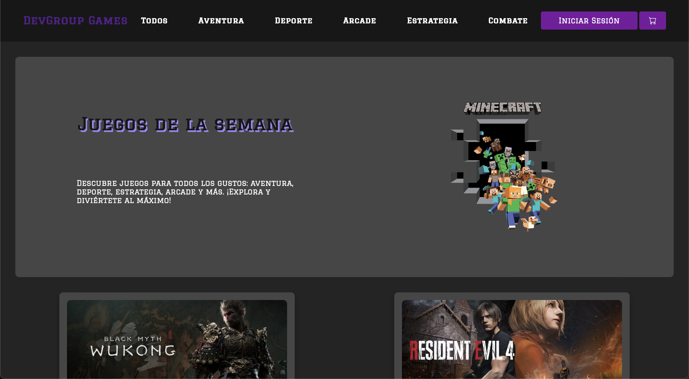

# 🎮 DevGroup Games - E-commerce de Videojuegos

 

## 🧩 Descripción del Proyecto

**DevGroup Games** es un e-commerce dedicado a la venta de videojuegos de diversas categorías. Este proyecto tiene como objetivo ofrecer una plataforma intuitiva y eficiente para la compra de videojuegos, brindando una experiencia de usuario atractiva y funcional. La aplicación está diseñada para ser responsive, permitiendo a los usuarios navegar cómodamente desde cualquier dispositivo.

## 🚀 Características

- **Navegación por categorías**: Los usuarios pueden explorar los videojuegos por diferentes géneros, como Aventura, Deportes, Arcade, Estrategia y Combate.
- **Sistema de autenticación**: Incluye funcionalidades de inicio de sesión, registro de nuevos usuarios y recuperación de contraseña.
- **Carrito de compras**: Permite agregar, eliminar y finalizar compras con facilidad.
- **Interfaz Responsiva**: La aplicación está optimizada para usarse tanto en dispositivos móviles como en computadoras.

## 🛠️ Tecnologías Utilizadas

- **Frontend**: HTML, CSS, JavaScript
- **Backend**: Node.js, Express
- **Base de datos**: PostgreSQL
- **Control de versiones**: Git, GitHub
- **Deploy**: Docker, Vercel, Render

## 🧑‍🤝‍🧑 Equipo de Desarrollo

**DevGroup Games** fue creado por el equipo:

- **Enzo Balderrama**
- **Joaquín Espósito**
- **Alejandro Perez**
- **Angelo Vellar**
- **Gabriel Gonzalez**
- **Marcos Martos**
- **Santiago Peñafiel**
- **Juan Ignacio Ruiz**
- **Bruno Olivera**

